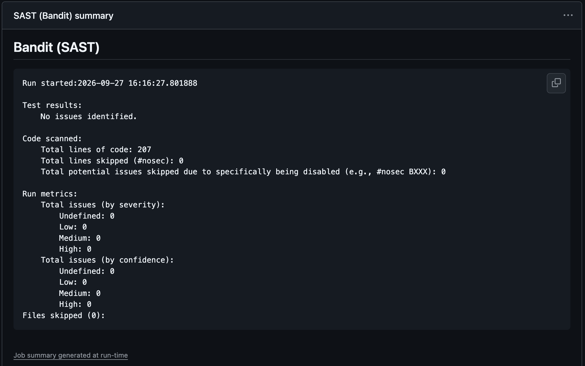
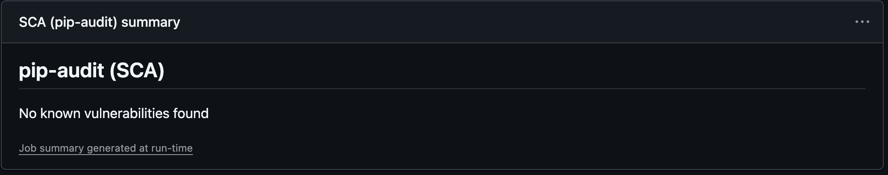
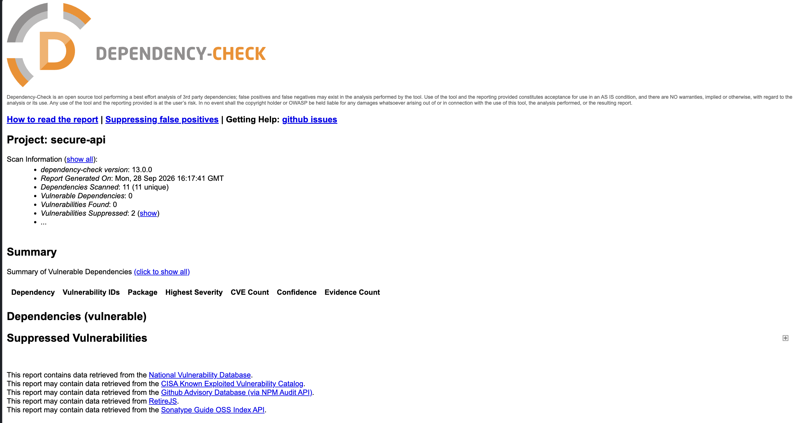

# Secure REST API

Учебное REST API на Flask с аутентификацией по JWT, защитой от SQL-инъекций и XSS и проверкой кода в CI (SAST + SCA).

**Стек:** Python 3.10+, Flask, Flask-JWT-Extended, bcrypt, SQLite, pytest, Bandit, pip-audit, OWASP Dependency-Check, GitHub Actions.

## Запуск

```bash
python3 -m venv venv
source venv/bin/activate
pip install -r requirements-dev.txt

export JWT_SECRET_KEY="$(python3 -c 'import secrets; print(secrets.token_hex(32))')"
python app.py            # http://127.0.0.1:5000
pytest -v                # тесты
```

| Переменная | Назначение | По умолчанию |
|---|---|---|
| `JWT_SECRET_KEY` | Секрет для подписи JWT (HS256) | случайный при каждом запуске |
| `DATABASE` | Путь к файлу SQLite | `app.db` |

## API

Все запросы и ответы — JSON. Ошибки возвращаются в виде `{"error": "..."}`.

| Метод | Путь | Авторизация | Описание |
|---|---|---|---|
| `POST` | `/auth/register` | — | Регистрация пользователя |
| `POST` | `/auth/login` | — | Вход, возвращает JWT |
| `GET` | `/api/data` | Bearer JWT | Список всех постов |
| `POST` | `/api/posts` | Bearer JWT | Создание поста |
| `GET` | `/api/me` | Bearer JWT | Данные текущего пользователя |

### `POST /auth/register`

```bash
curl -X POST http://127.0.0.1:5000/auth/register \
  -H "Content-Type: application/json" \
  -d '{"username": "alice", "password": "S3cure-passw0rd"}'
```

`201 {"message": "user created"}`; `400` — невалидные данные; `409` — логин занят.

Логин: 3–32 символа `[A-Za-z0-9_]`. Пароль: 8–72 байта.

### `POST /auth/login`

```bash
curl -X POST http://127.0.0.1:5000/auth/login \
  -H "Content-Type: application/json" \
  -d '{"username": "alice", "password": "S3cure-passw0rd"}'
```

```json
{"access_token": "eyJhbGciOi...", "token_type": "Bearer", "expires_in": 900}
```

`401 {"error": "invalid username or password"}` — при неверном логине или пароле (сообщение одинаковое).

### `GET /api/data`

```bash
TOKEN=...   # access_token из /auth/login
curl http://127.0.0.1:5000/api/data -H "Authorization: Bearer $TOKEN"
```

```json
{"posts": [{"id": 1, "author": "alice", "title": "Hello", "body": "First post", "created_at": "2026-09-27T16:00:00+00:00"}]}
```

Без токена или с поддельным токеном — `401`.

### `POST /api/posts`

```bash
curl -X POST http://127.0.0.1:5000/api/posts \
  -H "Authorization: Bearer $TOKEN" -H "Content-Type: application/json" \
  -d '{"title": "Hello", "body": "First post"}'
```

`201` — созданный пост. Заголовок 1–200 символов, текст 1–5000 символов.

### `GET /api/me`

```bash
curl http://127.0.0.1:5000/api/me -H "Authorization: Bearer $TOKEN"
```

`200 {"id": 1, "username": "alice"}`

## Реализованные меры защиты

### SQL Injection (OWASP A03:2021 — Injection)

- Все запросы к БД — **параметризованные** (`?`-плейсхолдеры `sqlite3`). Значения передаются драйверу отдельно от текста запроса, поэтому СУБД всегда интерпретирует их как данные, а не как SQL-код:

  ```python
  db.execute("SELECT id, password_hash FROM users WHERE username = ?", (username,))
  ```

- В коде нет ни одного запроса, собранного конкатенацией или f-строкой — это же проверяет Bandit (правило B608).
- Дополнительно: строгая валидация входных данных (тип `str`, whitelist-regex для логина, ограничения длины) и лимит размера тела запроса 16 КБ.

Проверка: полезные нагрузки `' OR '1'='1`, `alice' --`, `' UNION SELECT ...` в логине/пароле дают `401`; строка `x'); DROP TABLE users; --` в посте сохраняется как обычный текст (тесты `test_sql_injection_*`).

### XSS (OWASP A03:2021 — Injection)

- Все пользовательские данные, возвращаемые в ответах (`author`, `title`, `body`, `username`), **экранируются** функцией `markupsafe.escape` (та же, что используется в шаблонах Flask/Jinja2): `<` → `&lt;`, `>` → `&gt;`, `"` → `&#34;`, `'` → `&#39;`, `&` → `&amp;`.
- Ответы отдаются только как `application/json`, плюс защитные заголовки:
  - `Content-Security-Policy: default-src 'none'; frame-ancestors 'none'` — запрещает выполнение любых скриптов, если ответ всё же откроют в браузере;
  - `X-Content-Type-Options: nosniff` — браузер не будет «угадывать» тип и исполнять JSON как HTML;
  - `X-Frame-Options: DENY`, `Referrer-Policy: no-referrer`, `Cache-Control: no-store`.

Проверка: пост с `<script>alert("xss")</script>` возвращается как `&lt;script&gt;alert(&#34;xss&#34;)&lt;/script&gt;` (тест `test_xss_is_escaped`).

### Broken Authentication (OWASP A07:2021, A01:2021)

- **Хэширование паролей — bcrypt** (cost factor 12, уникальная соль для каждого пароля). Пароль в открытом виде нигде не хранится и не логируется.
- **JWT** выдаётся только после успешной проверки пароля: подпись HS256, секрет из переменной окружения `JWT_SECRET_KEY`, срок жизни токена — 15 минут, в `sub` — только id пользователя.
- **Middleware проверки токена** — декоратор `@jwt_required()` на всех защищённых маршрутах. Он проверяет подпись, алгоритм (принимается только `HS256`, токены с `alg: none` отклоняются), срок действия и тип токена; затем пользователь из `sub` ищется в БД — токен удалённого пользователя недействителен.
- **Нет перебора логинов:** при несуществующем пользователе всё равно выполняется `bcrypt.checkpw` против хэша-заглушки, а сообщение об ошибке одинаковое — по тексту и времени ответа нельзя понять, существует ли логин.
- Валидация сложности пароля при регистрации (8–72 байта; 72 — предел bcrypt).

Проверка: `test_protected_without_token`, `test_forged_token_rejected`, `test_alg_none_rejected`, `test_password_is_hashed`, `test_unknown_user_same_error`.

## CI/CD

Пайплайн [`.github/workflows/ci.yml`](.github/workflows/ci.yml) запускается на каждый `push` и `pull_request`:

| Job | Инструмент | Что делает |
|---|---|---|
| Tests | pytest | 19 тестов на функциональность и меры защиты |
| SAST | Bandit | Статический анализ кода; пайплайн падает при любой находке. Отчёт — в Summary и артефакте `bandit-report` |
| SCA | pip-audit | Проверка зависимостей из `requirements.txt` по базам PyPI Advisory / OSV. Отчёт — в Summary и артефакте `pip-audit-report` |
| SCA | OWASP Dependency-Check | Проверка зависимостей по NVD, HTML-отчёт в артефакте `dependency-check-report`. Для быстрой работы добавьте секрет `NVD_API_KEY` ([получить](https://nvd.nist.gov/developers/request-an-api-key)) |

### Исправленные уязвимости

При первом запуске pip-audit обнаружил уязвимость в транзитивной зависимости Flask:

| Пакет | Версия | Уязвимость | Исправление |
|---|---|---|---|
| click | 8.1.8 | PYSEC-2026-2132 | обновлён до 8.3.3 |

После обновления: `No known vulnerabilities found`.

### Отчёты

<!-- Вставьте скриншоты из вкладки Actions -->

**Bandit (SAST):**



**pip-audit (SCA):**



**OWASP Dependency-Check (SCA):**



**Последний успешный запуск:** <!-- ссылка на run в Actions -->

## Структура

```
.
├── app.py                    # приложение
├── tests/test_app.py         # тесты
├── requirements.txt          # зависимости (закреплённые версии)
├── requirements-dev.txt      # + pytest, bandit, pip-audit
└── .github/workflows/ci.yml  # CI-пайплайн
```
